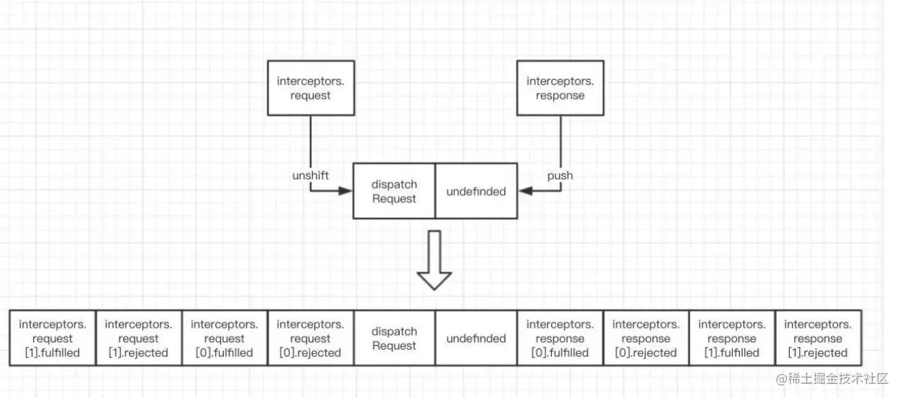

category:: Programing
type:: #Axios
alias:: Axios - Interceptors

- 
- 後添加的 request interceptor 會先執行
  logseq.order-list-type:: number
- 後添加的 response interceptor 會後執行
  logseq.order-list-type:: number
- ## Reference
	- [源码解析Axios拦截器执行顺序](https://juejin.cn/post/7128217937470554120)