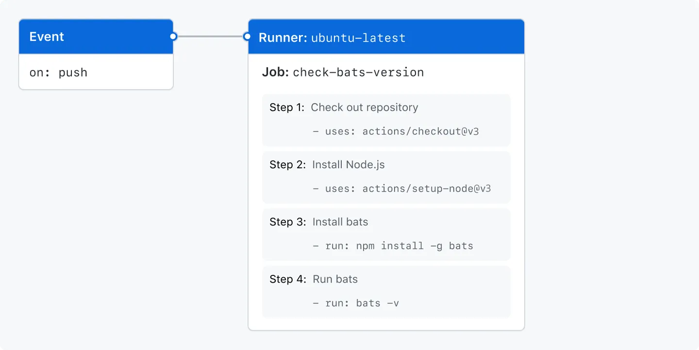

category:: Environment
type:: CD/CD
alias:: GitHub Actions

- > GitHub Actions 設定檔為 `.yml`, 且必須放置於 `.github/workflows` 資料夾下
  [[YAML 語法]]
- 
- ## 組成元件
	- **Event**: 觸發自動化工作流的功能
	- **Jobs**: 在同一個 Runner 執行的一組 Steps
		- **Step**: 可以是一個 shell script 或 action
		- 同一個 Job 內允許所有 Action 共享資料
	- **Action**: 可以重複使用的程式碼單元(Unit of Code)，可以自行撰寫，也可以使用 GitHub 社群創作的 Action 來完成工作流程
	- **Runner**: 負責執行自動化程式的 Server, 運作於 Ubuntu Linux, MS Windows, macOS 上
- ## Workflow syntax
	- ```yml
	  # 官方範例
	  name: learn-github-actions
	  run-name: ${{ github.actor }} is learning GitHub Actions
	  on: [push]
	  jobs:
	    check-bats-version:
	      runs-on: ubuntu-latest
	      steps:
	        - uses: actions/checkout@v3
	        - uses: actions/setup-node@v3
	          with:
	            node-version: '14'
	        - run: npm install -g bats
	        - run: bats -v
	  ```
	- `name: learn-github-actions`: 代表這個 workflow 的名稱
	- `run-name: ${{ github.actor }} is learning GitHub Actions`: 代表這個 workflow 的描述
	- `on: [push]`: 代表在什麼時候觸發這個 workflow
		- 此處代表每次 push 皆會觸發
	- `jobs:`: Groups together all the jobs
	- `check-bats-version:`: 代表這個 job 的名稱
	- `runs-on: ubuntu-latest`: 代表在哪個環境下執行這個 job
	- `steps:`: Groups together all the steps
	- `- uses:`: 要執行的 Action
		- 格式: `{owner}/{repo}@{ref}`
		- `with:`: 當前 Action 可以使用的設定
		- `actions/checkout@v3`: 讓 Workflow 可以取得程式碼
		  logseq.order-list-type:: number
		- `actions/setup-node@v3`: 可以設定 Node.js 的版本
		  logseq.order-list-type:: number
	- `- run:`: 要執行的命令
	- 可視化圖
	  collapsed:: true
		- {:height 383, :width 748}
- ## Reference
	- [Understanding GitHub Actions](https://docs.github.com/en/actions/learn-github-actions/understanding-github-actions)
	- [Events that trigger workflows](https://docs.github.com/en/actions/using-workflows/events-that-trigger-workflows#webhook-events)
	- [或許你該懂一下 CI/CD](https://israynotarray.com/other/20230520/2118016719/)