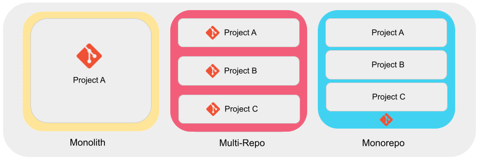

category:: Environment
type:: #Env, #Monorepo
alias:: Monorepo 架構

- > Monorepo 是將大量的程式碼集中管理的架構
- 
- **優點**
	- 程式可重用性高，可避免不必要的重複工作
	  logseq.order-list-type:: number
	- 程式碼更透明，更容易進行重構和維護
	  logseq.order-list-type:: number
	- 所有套件使用相同版本，包括測試和設定檔
	  logseq.order-list-type:: number
	- 所有程式碼風格一致，減少混亂
	  logseq.order-list-type:: number
	- 不同團隊之間的溝通更頻繁，有助於更好的協作
	  logseq.order-list-type:: number
- **缺點**
	- 沒辦法針對部分程式碼，設定權限
	  logseq.order-list-type:: number
	- 在進行大型專案時，Git 效能可能受到影響，因為代碼庫變得更加龐大
	  logseq.order-list-type:: number
	- 建置應用程式的時間可能較長，尤其是當代碼庫包含大量程式碼時
	  logseq.order-list-type:: number
- ## Reference
	- [[Monorepo - Nx]]