category:: Environment
type:: #Git
alias:: rebase

- > 除了 `git merge` 外，另一種合併分支的方式。
- ## 使用 rebase 合併
- {:height 235, :width 449}
- 切換到 issue2 分支後，對 issue1 執行 rebase 。
- ```bash
  $ git rebase issue1
  ```
- > issue2 分支將重新定義 base，並將 issue1 分支設定為 base
- _1682059860223_0.svg){:height 338, :width 388}
- > rebase 後的 commit 未完全刪除，而會被 Git 的資源回收機制回收
-
- ## Reference
	- [另一種合併方式（使用 rebase）](https://gitbook.tw/chapters/branch/merge-with-rebase)