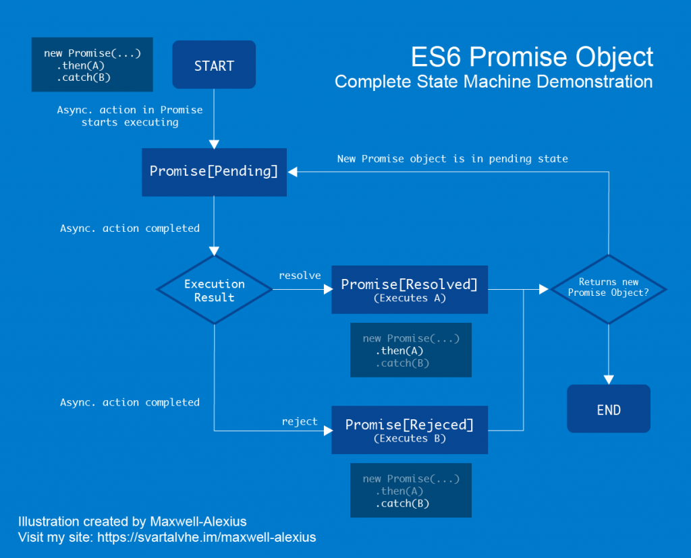

category:: Programing
type:: Javascript, API
alias:: Nested Promise
version:: ES6

- ## `Promise` 的狀態機示意圖
	- 
- ## Nested Promise
	- 皆使用 `then` 然後 `catch`
		- ```JAVASCRIPT
		  new Promise(/* ... */)
		  	.then(function() {
		    		return new Promise(/* ... */)
		  	})
		  	.catch(/* ... */)
		  	.then(function() {
		    		return new Promise(/* ... */)
		  	})
		  	.catch(/* ... */)
		  ```
	- 在 `then` 的第二個參數位置進行 `catch`
		- ```javascript
		  new Promise(/* ... */)
		    .then(function() {
		      return new Promise(/* ... */)
		    }, function() {/* ... */})
		    .then(function() {
		      return new Promise(/* ... */)
		    }, function() {/* ... */})
		  ```