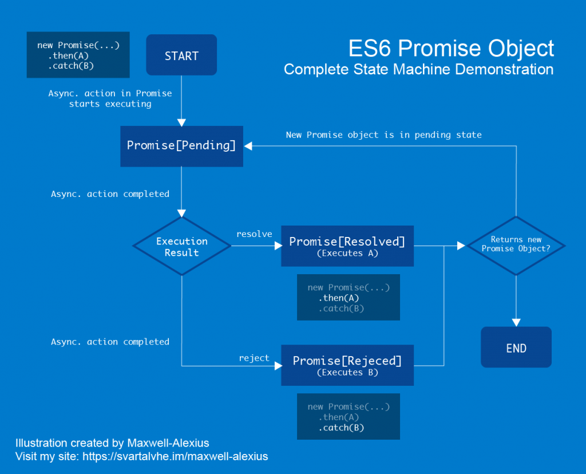

category:: Programing
type:: #Javascript, #API
alias:: Promise
version:: ES6

- ## `Promise` 的狀態機示意圖
	- 
- ## `Promise` 基本用法
	- `Promise` 的構造函式接收一個函式作為參數。
	- 而該函式接受兩個額外的函式，`resolve` 和 `reject` ，這兩個函式分別代表將當前 `Promise` 置為 **fulfilled(解決)** 和 **rejected(拒絕)**兩個狀態。
	- `Promise` 正是通過這兩個狀態來控制非同步的結果。
	- ```ts
	  const p = new Promise((resolve, reject) => {
	  	setTimeout(() => {
	  		const random = Math.random();
	  		random > 0.5 ? resolve('成功', random) : reject(Error('失敗', random))
	  	}, 2000)
	  })
	  
	  p.then((response) => {
	  	console.log(response)
	  })
	  .catch((error) => {
	  	console.error(error)
	  })
	  ```
	- 每個 Promise 的實例對象，都有一個 `then` 的方法，這個方法就是用來處理各種非同步的結果。
	- 此外還有一個 `catch` 方法，當某個環節的Promise的非同步處理出錯時，將終止其後的調用，直接跳到最後的 `catch` ，並捕獲失敗的訊息。
	- ```javascript
	  p.then((response) => {
	    console.log(response)
	  }).catch((error) => {
	    console.error(error)
	  })
	  ```
- ## Nested Promise
	- > **`Promise` 物件是可以被串接的**
	- 皆使用 `then` 然後 `catch`
	- ```ts
	  new Promise(/* ... */)
	  	.then(function() {
	    		return new Promise(/* ... */)
	  	})
	  	.catch(/* ... */)
	  	.then(function() {
	    		return new Promise(/* ... */)
	  	})
	  	.catch(/* ... */)
	  ```
	- 在 `then` 的第二個參數位置進行 `catch`
	- ```ts
	  new Promise(/* ... */)
	    .then(function() {
	      return new Promise(/* ... */)
	    }, function() {/* ... */})
	    .then(function() {
	      return new Promise(/* ... */)
	    }, function() {/* ... */})
	  ```