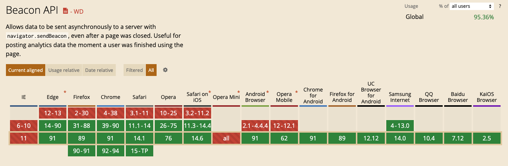

category:: Programming
type:: #Javascript, #Navigator
alias:: Navigator.sendBeacon

- ## Syntax
	- ```js
	  sendBeacon(url, data)
	  ```
	- **Parameters**
		- url: data 將要發送的 url, 可以為相對路徑或絕對路徑
		- data: 可傳送 [`ArrayBuffer`](https://developer.mozilla.org/en-US/docs/Web/JavaScript/Reference/Global_Objects/ArrayBuffer), [`TypedArray`](https://developer.mozilla.org/en-US/docs/Web/JavaScript/Reference/Global_Objects/TypedArray), [`DataView`](https://developer.mozilla.org/en-US/docs/Web/JavaScript/Reference/Global_Objects/DataView), [`Blob`](https://developer.mozilla.org/en-US/docs/Web/API/Blob), [`FormData`](https://developer.mozilla.org/en-US/docs/Web/API/FormData), [`URLSearchParams`](https://developer.mozilla.org/en-US/docs/Web/API/URLSearchParams), `String` or `Object` 等格式
	- **Return**
		- 當 [user agent](https://developer.mozilla.org/en-US/docs/Glossary/User_agent) 成功將 data 排入傳送對列時返回 `true`, 否則返回 `false`
- ## Example
	- ```js
	  window.onpagehide = () => {
	    navigator.sendBeacon('/log', analyticsData);
	  };
	  ```
- ## Can I Use
  collapsed:: true
	- 
- ## Reference
	- [MDN Navigator: sendBeacon() method](https://developer.mozilla.org/en-US/docs/Web/API/Navigator/sendBeacon)
	- [sendBeacon - 在頁面結束時傳送資料](https://hackmd.io/@ritatariiiii/rkrJwMPiu#sendBeacon---%E5%9C%A8%E9%A0%81%E9%9D%A2%E7%B5%90%E6%9D%9F%E6%99%82%E5%82%B3%E9%80%81%E8%B3%87%E6%96%99)