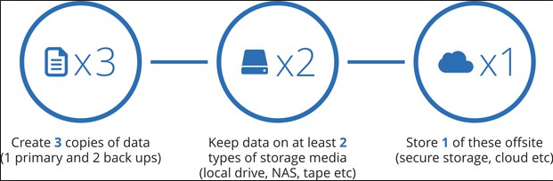

category:: Note
type:: Backup
alias:: 3-2-1 備份原則

## 「3-2-1 備份」- 資料備份的重要原則
- > **最重要的是在做完備份計畫後，一定要測試檔案是否可以確實復原，以免做白工！**
- {:height 205, :width 577}
- 至少 **3** 份資料備份：在原始檔案資料損壞或遺失時，得以將檔案還原。
	- 1 份原始檔 + 1 份本地端備份 + 1 份異地備份
- 存放 **2** 種不同儲存媒介：利用不同儲存媒介的優缺點互補，預防不同類型的危險。
	- 本地端, NAS, 外接硬碟, etc
- 至少 1 份異地備份：降低任何天災、火災、失竊等狀況發生時，所有儲存裝置同時遭到破壞或竊取的風險。
	- 雲端儲存空間, etc
- ## Reference
	- [「3-2-1 備份」- 資料備份的重要原則](https://www.asustor.com/solution/backup_rules)