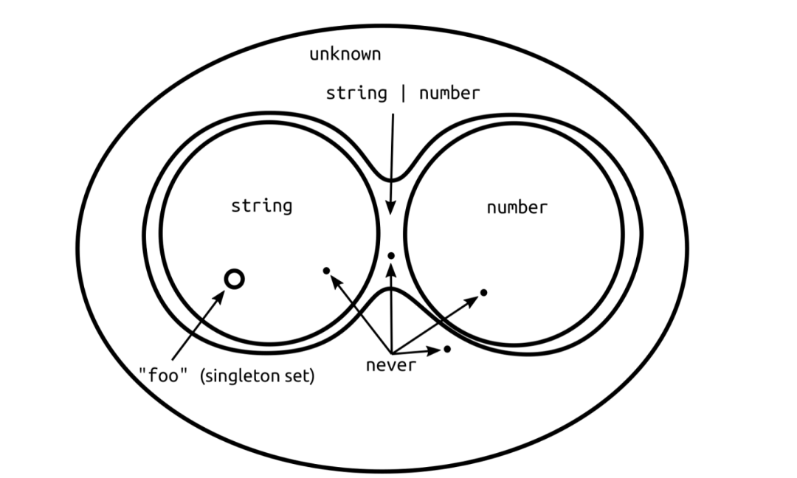

category:: Programming
type:: #Typescript
alias:: TS Basic Types

- ## unknown
- alias:: unknown 型別
  version:: 3.0+
	- > 未知類型，替代 `any` 的安全版本
	- Typescript 中與 `any` 同為 **Top type**，能被賦值為任何型別，但不能賦值給 `any` 與 `unknown` 以外的型別
	- ```typescript
	  let x: unknown;
	  let num = 123;
	  let str = 'string';
	  let _any: any;
	  
	  x = num; // ok
	  _any = x; // ok
	  str = x; // error
	  ```
	- 使用此型別需要收窄型別範圍
		- 1. 斷言 **as**
		  ```typescript
		  let x: unknown = 'string';
		  
		  let str: string = x as string;
		  ```
		- 2. [[Type Guard]]
		  ```typescript
		  let x: unknown = 'string';
		  
		  let str: string;
		  
		  if (typeof x === 'string') {
		      str = x;
		  }
		  ```
- ## never
- alias:: never 型別
  version:: 2.0+
	- > **空**類型，值永不存在的型別
	- function 執行後拋出異常，此函數永不存在返回值。
	- 無窮迴圈的程式碼，永不存在返回值。
	- Typescript 中唯一的 **Bottom type**，為所有型別的子型別，能賦值給任何型別
	- ```typescript
	  let err: never;
	  let num: number = 4;
	  
	  // config "strictNullChecks": false
	  num = err; // ok
	  ```
- ## void
- alias:: void 型別
	- > 宣告一個 `void` 型別的函式，表示沒有任何返回值或返回 `undefined` 的函式
	  宣告一個 `void` 型別的變數，只能賦值 `undefined` 和 `void`
	- ```typescript
	  function voidFn(): void {};
	  function voidFn(): void { return; };
	  function voidFn(): void { return undefined; };
	  ```
	- ```typescript
	  let x: void;
	  
	  let u: undefined = undefined;
	  let v: void;
	  let n: null = null;
	  
	  x = u; // ok
	  x = v; // ok
	  x = n; // error
	  // "strictNullChecks": false
	  x = n; // ok
	  ```
- ## 名詞解釋
	- Top type
	- > The top type is sometimes called also *universal type*, or *universal supertype* as all other types in the type system of interest are subtypes of it.
	  >> 通用型別，能夠包含所有值的型別。
	- Bottom type
	- > the **bottom type** of a type system is the type that is a subtype of all other types.
	  When the bottom type is empty, a function whose return type is bottom cannot return any value, not even the lone value of a unit type. In such a language, the bottom type may therefore be known as the **zero** or **never** type.
	  >> 所有型別的子型別。
	  沒有值的型別，也被稱為**零**或**空**型別。
	- 
- ## Reference
	- [Type Compatibility](https://www.typescriptlang.org/docs/handbook/type-compatibility.html#any-unknown-object-void-undefined-null-and-never-assignability)
	- [never 和 unknown 的優雅之道](https://www.readfog.com/a/1665831681443074048)